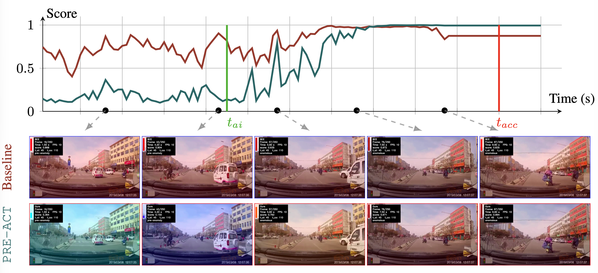
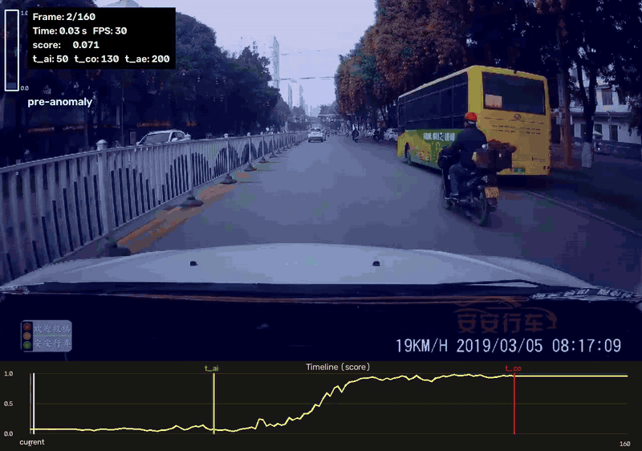

# Progressive Risk Estimation for Accident Anticipation

<p align="center">
  <a href="https://arxiv.org/abs/2609.32811"></a>
  <a href="https://huggingface.co/samethi/PRE-ACT"></a>
  <a href="#citation"></a>
</p>

<p align="center">
  <b>Official implementation of PRE-ACT for video-based accident anticipation.</b>
</p>

<!-- Optional teaser / method figure -->
<!-- <p align="center">
  
</p> -->

<p align="center">
  
</p>

## Abstract

Accident anticipation aims to recognize anomalous driving cues before a crash
while avoiding false alarms during normal driving. Existing approaches typically
formulate this task as binary classification, focusing on whether an accident will
occur rather than when it will occur. We propose PRE-ACT, a framework that
models accident risk as a continuously evolving signal that increases as the crash
approaches. By explicitly enforcing temporal ordering and distance-to-accident
awareness, our method progressively raises risk while suppressing premature
alarms, leading to significant improvements on MM-AU subsets and Nexar. We
further introduce a Separation Score to evaluate the global behavior of predicted
risk curves beyond local temporal windows. 


## Results


### CAP

**Results on the CAP split of MM-AU.** 

| Method   | AUC<sub>0.0s</sub><sup>0.1</sup> | AUC<sub>0.5s</sub><sup>0.1</sup> | AUC<sub>1.0s</sub><sup>0.1</sup> | AUC<sub>1.5s</sub><sup>0.1</sup> | mAUC<sup>0.1</sup> | mTTA<sup>0.1</sup> |
| :------- | -------------------------------: | -------------------------------: | -------------------------------: | -------------------------------: | -----------------: | -----------------: |
| CAP      |                            0.042 |                            0.040 |                            0.030 |                            0.037 |              0.036 |              0.637 |
| DRIVE    |                            0.129 |                            0.117 |                            0.108 |                            0.123 |              0.116 |              0.395 |
| DSTA     |                            0.559 |                            0.386 |                            0.282 |                            0.191 |              0.286 |              0.804 |
| GSC      |                            0.609 |                            0.418 |                            0.297 |                            0.199 |              0.305 |              0.817 |
| TOP      |                            0.838 |                            0.675 |                            0.398 |                        **0.214** |              0.429 |              0.864 |
| **PRE-ACT** |     **0.887** |    **0.775** |                        **0.465** |                            0.201 |          **0.481** |              **1.125** |

---

### DADA

**Results on the DADA split of MM-AU.**

| Method     | AUC<sub>0.0s</sub><sup>0.1</sup> | AUC<sub>0.5s</sub><sup>0.1</sup> | AUC<sub>1.0s</sub><sup>0.1</sup> | AUC<sub>1.5s</sub><sup>0.1</sup> | mAUC<sup>0.1</sup> | mTTA<sup>0.1</sup> |
| :--------- | -------------------------------: | -------------------------------: | -------------------------------: | -------------------------------: | -----------------: | -----------------: |
| CAP        |                            0.032 |                            0.037 |                            0.067 |                            0.064 |              0.056 |              0.496 |
| DRIVE      |                            0.101 |                            0.063 |                            0.077 |                            0.088 |              0.076 |              0.226 |
| DSTA       |                            0.473 |                            0.328 |                            0.221 |                            0.135 |              0.228 |              0.695 |
| GSC        |                            0.514 |                            0.350 |                            0.238 |                            0.139 |              0.242 |              0.703 |
| TOP        |                            0.790 |                            0.567 |                            0.288 |                            0.140 |              0.332 |              0.885 |
| **PRE-ACT**   | **0.861** |    **0.751** |          **0.398** |           **0.170** |          **0.440** |          **1.069** |

---

### Nexar

**Results on the Nexar dataset.**

| Method   | AP<sub>0.5s</sub> | AP<sub>1.0s</sub> | AP<sub>1.5s</sub> |       mAP |      mAUC | mAUC<sup>0.1</sup> | mTTA<sup>0.1</sup> |         s |
| :------- | ----------------: | ----------------: | ----------------: | --------: | --------: | -----------------: | -----------------: | --------: |
| AdaLEA   |                 – |                 – |                 – |     0.832 |     0.828 |              0.378 |              0.858 |         – |
| GSC      |                 – |                 – |                 – |     0.811 |     0.802 |              0.322 |              0.839 |         – |
| CAP      |                 – |                 – |                 – |     0.793 |     0.817 |              0.315 |              0.801 |         – |
| CRASH    |                 – |                 – |                 – |     0.846 |     0.832 |              0.393 |              0.857 |         – |
| **PRE-ACT**  |         **0.919** |         **0.911** |         **0.854** | **0.895** | **0.895** |          **0.510** |          **1.285** | **0.665** |


## Pretrained Models

Pretrained checkpoints are available on [Hugging Face](https://huggingface.co/samethi/PRE-ACT).

| Training dataset | Backbone | Checkpoint |
|:--|:--|:--|
| CAP | VideoMAE-L | [Download](https://huggingface.co/samethi/PRE-ACT/resolve/main/CAP/model.pt?download=true) |
| DADA-2000 | VideoMAE-L | [Download](https://huggingface.co/samethi/PRE-ACT/resolve/main/DADA/model.pt?download=true) |


## Installation

```bash
git clone https://github.com/giddyyupp/PRE-ACT
cd pre_act

conda create -n preact python=3.11
conda activate preact

conda install pytorch==2.9.1 torchvision==0.24.1 pytorch-cuda=12.8 -c pytorch -c nvidia
pip install -r requirements.txt
```

## Datasets

All datasets used in the paper are publicly available.

### MM-AU / CAP / DADA-2000

Download MM-AU from Hugging Face:

https://huggingface.co/datasets/JeffreyChou/MM-AU

Expected structure:

```text
MM_AU/
├── CAP-DATA_chunks/
│   ├── 1-10/
│   │   └── CAP-DATA/
│   │       └── 1-10/
│   │           ├── 1/
│   │           │   ├── 001537/
│   │           │   │   └── images/
│   │           │   │       ├── 000001.jpg
│   │           │   │       ├── 000002.jpg
│   │           │   │       └── ...
│   │           │   ├── 002004/
│   │           │   │   └── images/
│   │           │   ├── 002469/
│   │           │   │   └── images/
│   │           │   └── ...
│   │           ├── 2/
│   │           ├── 3/
│   │           ├── 4/
│   │           ├── 5/
│   │           ├── 6/
│   │           ├── 7/
│   │           ├── 8/
│   │           ├── 9/
│   │           └── 10/
│   ├── 11/
│   ├── 12-42/
│   ├── 43/
│   └── 44-62/
│
├── DADA-2000_chunks/
│   └── Origin/
│       └── DADA2000/
│           └── DADA2000/
│               ├── 1/
│               ├── 2/
│               ├── ...
│               └── 61/
│
├── cap_text_annotations.xls
├── dada_text_annotations.xlsx
├── video_metadata.json
│
├── MMAU/
├── MMAU_Detv1/
├── MMAU_Det_paper/
├── LOTVS-CAP_checkpoints/
├── README.md
└── .gitattributes
```

### Nexar

Download Nexar Collision Prediction from:

https://huggingface.co/datasets/nexar-ai/nexar_collision_prediction

An example frame-extraction utility is provided in `prepare_data.py`:

```python
extract_nexar_frames(...)
```

### DAD

Download the DAD dataset using following link:

https://aliensunmin.github.io/project/dashcam/

## Training

The repository contains scripts for training PRE-ACT as well as several backbone baselines.

Example: training PRE-ACT on CAP with VideoMAE-L using 4 GPUs in a Slurm environment:

```bash
export PYTHONPATH="$(pwd):${PYTHONPATH:-}"

set -x

srun torchrun \
    --standalone \
    --nproc_per_node=4 \
    train_autoencoder_anticipation_ddp.py \
    --num-workers 8 \
        --batch-size 16 \
        --root ../../data/MM_AU \
        --subset CAP \
        --backbone-type videomae \
        --backbone-name MCG-NJU/videomae-large \
        --freeze-backbone \
        --unfreeze-last-n-blocks 4 \
        --backbone-lr 2e-5 \
        --head-lr 2e-4 \
        --lambda-bce 1.0 \
        --lambda-prog 10.0 \
        --lambda-pref 0.1 \
        --custom_risk_mode "exp_above" \
        --progress-alpha 3.0 \
        --anticipation-horizon-sec 2.0 \
        --snippet-len 5 \
        --train-stride 5 \
        --image-size 224 \
        --epochs 30 \
        --eval-every-n-epochs 1 \
        --eval-mode sliding_window \
        --eval-score-key score \
        --eval-anno-json ./annotations/mm_au_cap_anno.json \
        --eval-batch-size 128 \
        --save-eval-predictions \
        --pref-loss-type "margin_ranking" \
        --seed 42 \
        --output-dir ./outputs_CAP/videomae_large_unfreeze_4blocks_bce1_prog10_pref01_risk_exp_above3_head_v4_margin_ranking_seed42
```


## Inference

Run sliding-window inference with a trained checkpoint, for instance above model:

```bash

model_id="videomae_large_unfreeze_4blocks_bce1_prog10_pref01_risk_exp_above3_head_v4_margin_ranking_seed42"

srun torchrun \
  --standalone \
  --nproc_per_node=4 \
  test_encoder_anticipation_ddp.py \
  --batch-size 200 \
  --num-workers 1 \
  --checkpoint ./outputs_CAP/$model_id/best_mauc_0_1.pt \
  --root /path/to/data/MM_AU \
  --metadata-json /path/to/data/MM_AU/video_metadata.json \
  --subset CAP \
  --split-name test \
  --run-sliding-window \
  --eval-score-key risk_score \
  --eval-anno-json ./annotations/mm_au_cap_anno.json \
  --save-dir ./results_CAP/${model_id}

```

Inference automatically prints all the metrics reported in the paper.


## Repository Structure

```text
accident_anticipation/
├── annotations/          # Dataset annotations
├── dataloaders/          # Dataloaders
├── engine/               # Optimizer
├── evaluation/           # Evaluation scripts
├── losses/               # Loss functions
├── models/               # PRE-ACT and backbone definitions
├── slurm_scripts/        # Optional training / inference scripts
├── test_autoencoder_anticipation_ddp.py
├── train_autoencoder_anticipation_ddp.py
├── prepare_data.py
├── requirements.txt
└── README.md
```

Adjust the tree above to exactly match the final public repository before release.

## Reproducing the Results

For exact reproduction, we recommend using the hyperparameters reported in the paper and the released configuration / training scripts. 

Pretrained checkpoints are provided to make evaluation possible without retraining the models from scratch.

## Citation

If you find this work useful, please cite:

```bibtex
@article{preact2026hicsonmez,
  title   = {Progressive Risk Estimation for Accident Anticipation},
  author  = {Samet Hicsonmez, Eray Çakar, Nermin Samet, Fatma Güney},
  journal = {NeurIPS},
  year    = {2026}
}
```

## Acknowledgements

This repository builds on publicly available models and datasets. Please also cite the corresponding dataset and backbone papers when using them.

